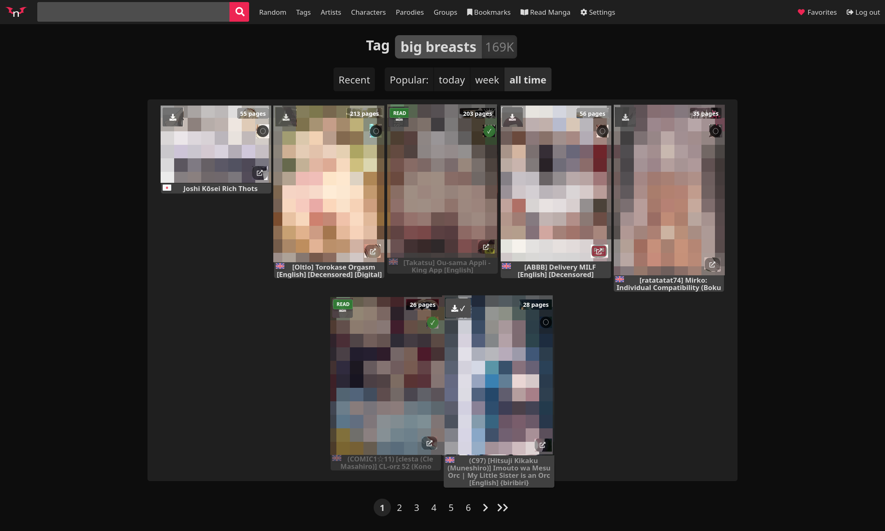
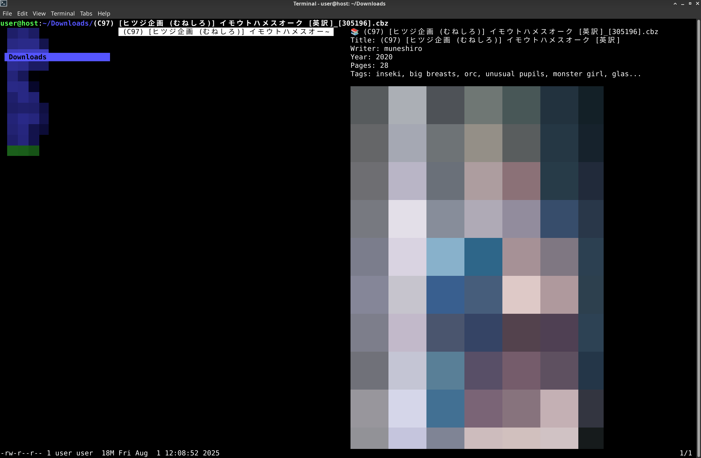
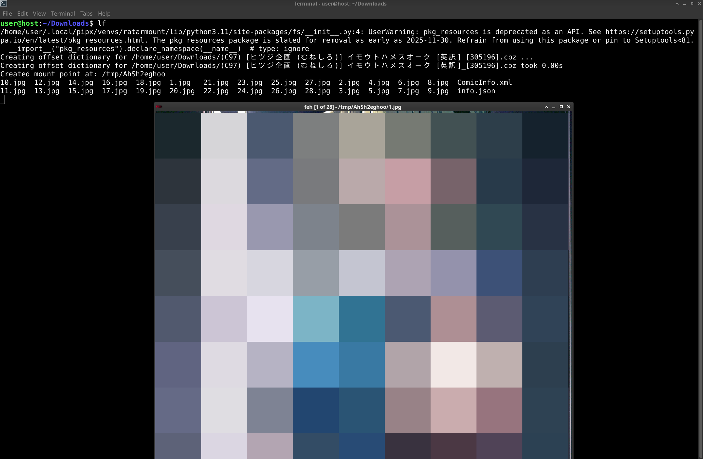

# nhentai-tools

This repository contains tools and configurations to enhance your nhentai browsing experience.

## Prerequisites

Before you begin, ensure you have the following installed:

*   **Web Browser Extensions:**
    *   [uBlock Origin](https://addons.mozilla.org/en-US/firefox/addon/ublock-origin/)
    *   [Violentmonkey](https://addons.mozilla.org/en-US/firefox/addon/violentmonkey/)
*   **Terminal File Manager:**
    *   [lf](https://github.com/gokcehan/lf)
*   **System Packages:**
    *   `chafa`
    *   `caca-utils`
    *   `jp2a`
    *   `feh`
*   **Python Packages (via pipx):**
    *   `ratarmount`

You can install the system packages using `sudo apt install chafa caca-utils jp2a lf pipx feh`.
Install `ratarmount` using `pipx install ratarmount`.

## Setup Instructions

### uBlock Origin

1.  Open uBlock Origin settings.
2.  Navigate to the "Filters" tab.
3.  Import the filter list from `ublock/nhentai.txt`.

### Violentmonkey

Install the following user scripts:

*   **Nhentai Plus+**: [https://update.sleazyfork.org/scripts/498553/Nhentai%20Plus%2B.user.js](https://update.sleazyfork.org/scripts/498553/Nhentai%20Plus%2B.user.js)
*   **nHentai Helper**: [https://update.sleazyfork.org/scripts/375992/nHentai%20Helper.user.js](https://update.sleazyfork.org/scripts/375992/nHentai%20Helper.user.js)

For more details on `nHentai Helper`, refer to `violentmonkey/nhentai-helper.md`.

### lf (Terminal File Manager)

1.  Download `pistol` from its releases page: [https://github.com/doronbehar/pistol/releases](https://github.com/doronbehar/pistol/releases)
2.  Edit `lf/custom-previewer.sh` to correctly point to your program paths.

## Showcase



```
user@host:~/Downloads$ ls | grep cbz
(C97) [ヒツジ企画 (むねしろ)] イモウトハメスオーク [英訳]_[305196].cbz
```

opening lf for browsing



hitting o to read

